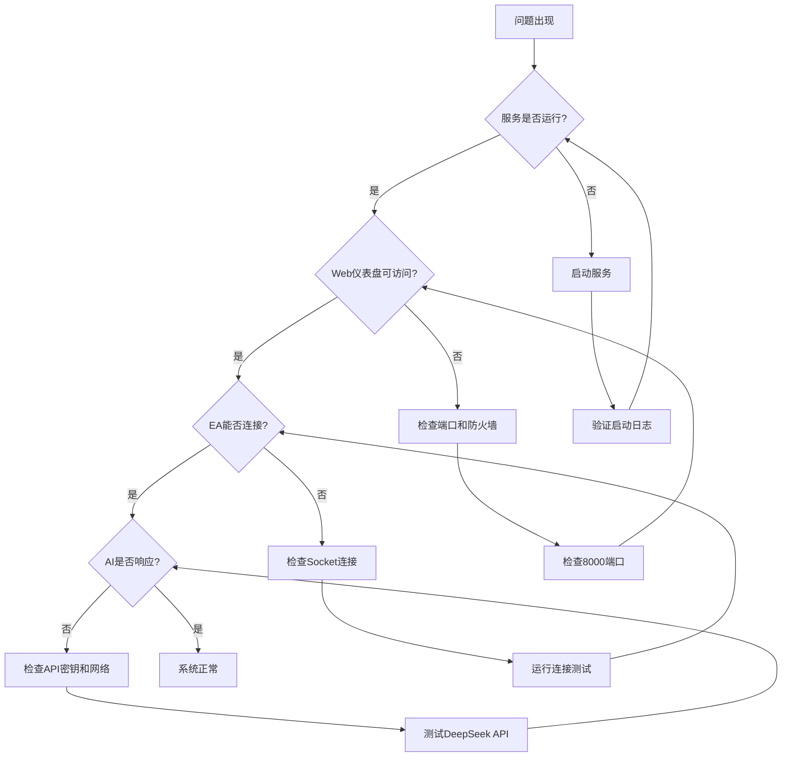

# 🔧 故障排除指南

> 常见问题诊断和解决方案

## 快速诊断流程图



## 按症状诊断

### 症状1：服务无法启动

#### 可能原因和解决方案

##### 问题1.1：Python依赖缺失
**症状**：
```
ModuleNotFoundError: No module named 'flask'
或类似导入错误
```

**解决方案**：
```powershell
# 安装所有依赖
pip install -r requirements.txt

# 如果仍有问题，尝试升级pip
python -m pip install --upgrade pip

# 使用虚拟环境（推荐）
python -m venv venv
venv\Scripts\activate
pip install -r requirements.txt
```

##### 问题1.2：端口被占用
**症状**：
```
OSError: [Errno 10048] 通常每个套接字地址只允许使用一次
或端口冲突错误
```

**解决方案**：
```powershell
# 查看端口占用
netstat -ano | findstr :8080
netstat -ano | findstr :8000

# 终止占用进程（谨慎操作）
taskkill /PID <进程ID> /F

# 或使用其他端口
python mt5_ai_service.py --socket-port 8082 --http-port 8002
```

##### 问题1.3：配置文件错误
**症状**：
```
KeyError: 'DEEPSEEK_API_KEY'
或配置验证失败
```

**解决方案**：
```powershell
# 检查.env文件是否存在
Test-Path .env

# 复制模板文件
copy .env.example .env

# 编辑.env文件，确保所有必需字段已设置
# 特别注意：DEEPSEEK_API_KEY必须设置
```

#### 服务启动检查清单
1. [ ] Python版本 ≥ 3.8
2. [ ] requirements.txt 已安装
3. [ ] .env 文件存在且配置正确
4. [ ] 所需端口（8080,8081,8000）未被占用
5. [ ] 有足够的磁盘空间
6. [ ] 有网络连接（如需访问AI API）

### 症状2：Web仪表盘无法访问

#### 问题2.1：服务未启动或崩溃
**解决方案**：
```powershell
# 检查服务进程
tasklist | findstr python

# 查看服务日志
Get-Content service.log -Tail 50

# 重启服务
python mt5_ai_service.py --log-level DEBUG
```

#### 问题2.2：防火墙阻止访问
**解决方案**：
```powershell
# 临时禁用防火墙（测试用）
netsh advfirewall set allprofiles state off

# 添加防火墙规则
netsh advfirewall firewall add rule name="MT5 AI Service" dir=in action=allow protocol=TCP localport=8000

# 检查端口监听
netstat -an | findstr :8000
```

#### 问题2.3：绑定地址错误
**解决方案**：
```powershell
# 检查绑定的IP地址
# 在.env中设置：
# SOCKET_HOST=0.0.0.0  # 允许所有IP访问
# 或
# SOCKET_HOST=127.0.0.1  # 仅本地访问

# 重启服务
python mt5_ai_service.py
```

### 症状3：EA无法连接Socket服务

#### 问题3.1：服务未运行
**解决方案**：
```powershell
# 确认服务正在运行
tasklist | findstr python

# 如果没有运行，启动服务
python mt5_ai_service.py

# 检查服务日志
Get-Content service.log -Tail 20 | Select-String "Socket"
```

#### 问题3.2：网络配置错误
**解决方案**：
1. **检查EA参数**：
   - Socket地址：127.0.0.1
   - Socket端口：8080
   - 连接超时：3000ms

2. **测试Socket连接**：
   ```powershell
   python tools/test_socket_connection.py --host 127.0.0.1 --port 8080 --timeout 3000
   ```

3. **检查防火墙**：
   ```powershell
   # 允许端口8080
   netsh advfirewall firewall add rule name="MT5 Socket" dir=in action=allow protocol=TCP localport=8080
   ```

#### 问题3.3：时间不同步问题
**症状**：EA日志显示连接失败，但服务实际已启动

**解决方案**：
1. **增加EA重试次数**：
   - 修改EA参数：最大重试次数 = 5
   - 连接超时 = 5000ms

2. **添加启动延迟**：
   ```mql5
   // 在EA的OnInit函数中添加延迟
   Sleep(5000);  // 等待5秒确保服务就绪
   ```

3. **优化CheckSocketAvailability函数**：
   - 添加指数退避重试
   - 增加连接验证步骤

### 症状4：AI无响应或响应慢

#### 问题4.1：API密钥无效或过期
**解决方案**：
```powershell
# 测试API密钥
python tools/test_deepseek.py --api-key "您的密钥"

# 检查密钥余额
# 访问DeepSeek官网查看使用情况和余额

# 更换API密钥
# 在.env中更新DEEPSEEK_API_KEY
```

#### 问题4.2：网络连接问题
**解决方案**：
```powershell
# 测试到DeepSeek API的网络
ping api.deepseek.com

# 使用curl测试API
curl -X POST https://api.deepseek.com/v1/chat/completions \
  -H "Authorization: Bearer 您的密钥" \
  -H "Content-Type: application/json" \
  -d '{"model":"deepseek-chat","messages":[{"role":"user","content":"test"}]}'

# 如果网络慢，增加超时时间
# 在.env中设置：REQUEST_TIMEOUT=60
```

#### 问题4.3：API限制或配额不足
**解决方案**：
1. **检查使用情况**：
   - 登录DeepSeek控制台
   - 查看API调用次数和配额

2. **优化使用**：
   - 增加缓存大小减少API调用
   - 降低请求频率
   - 使用更便宜的模型（如果支持）

3. **升级套餐**：
   - 购买更高配额
   - 联系DeepSeek支持

### 症状5：EA交易异常

#### 问题5.1：交易不被执行
**解决方案**：
1. **检查MT5设置**：
   - 工具 → 选项 → 交易 → 启用自动交易
   - 确保EA交易权限已开启
   - 检查账户是否有足够资金

2. **检查置信度阈值**：
   - 默认0.65，可调整为0.6
   - 在.env中设置：CONFIDENCE_THRESHOLD=0.6

3. **检查交易时间**：
   - 确保在市场开市时间
   - 检查是否有交易限制

#### 问题5.2：错误止损止盈
**解决方案**：
1. **验证止损止盈水平**：
   - 检查品种的最小止损距离
   - 在MT5中：右键品种 → 规格 → 止损水平

2. **调整EA参数**：
   - 增加止损点数
   - 确保止损大于最小要求

3. **启用止损验证**：
   - 在.env中设置：VALIDATE_STOP_LEVELS=true

#### 问题5.3：持仓管理错误
**解决方案**：
1. **检查持仓限制**：
   ```powershell
   # 在.env中调整
   MAX_POSITIONS=3  # 减少同时持仓数
   ```

2. **启用安全检查**：
   ```powershell
   # 确保所有安全检查启用
   ENABLE_SAFETY_CHECKS=true
   ALLOW_REVERSE_CLOSE=true
   ```

3. **检查持仓方向**：
   - EA会检查现有持仓方向
   - 避免同时持有多空仓位

### 症状6：性能问题

#### 问题6.1：响应时间慢
**解决方案**：
```powershell
# 监控响应时间
python tools/performance_monitor.py --metric response_time

# 优化缓存
# 在.env中增加缓存大小
CACHE_SIZE=200

# 减少AI请求复杂度
# 修改core/ai_engine.py中的提示词
```

#### 问题6.2：高CPU或内存使用
**解决方案**：
```powershell
# 监控资源使用
python tools/monitor_resources.py --interval 5

# 优化配置
# 减少缓存大小
CACHE_SIZE=50

# 减少并发数
CONNECTION_POOL_SIZE=5

# 重启服务释放资源
```

#### 问题6.3：数据库性能问题
**解决方案**：
```powershell
# 优化数据库
python tools/db_maintenance.py --vacuum --reindex

# 清理旧数据
python tools/clean_old_data.py --days 30

# 如果问题持续，考虑升级到更快的存储
```

## 工具和脚本

### 诊断工具列表

#### 1. 网络诊断工具
```powershell
# 测试Socket连接
python tools/test_socket_connection.py --host 127.0.0.1 --port 8080

# 测试WebSocket连接
python tools/test_websocket_connection.py --url ws://127.0.0.1:8081

# 测试HTTP连接
python tools/test_http_connection.py --url http://127.0.0.1:8000
```

#### 2. AI服务诊断工具
```powershell
# 测试DeepSeek API
python tools/test_deepseek.py --verbose

# 测试AI引擎
python tools/test_ai_engine.py --symbol EURUSD --periods 50

# 性能测试
python tools/benchmark_ai.py --iterations 10
```

#### 3. 系统诊断工具
```powershell
# 检查系统配置
python tools/validate_config.py --all

# 监控资源使用
python tools/monitor_resources.py --output dashboard.html

# 检查日志错误
python tools/analyze_logs.py --log-file service.log --level ERROR
```

### 自动化诊断脚本
```powershell
# 运行完整诊断
python tools/full_diagnosis.py --output report.html

# 诊断特定问题
python tools/diagnose.py --problem socket_connection --fix

# 生成健康报告
python tools/health_check.py --detailed
```

## 紧急恢复步骤

### 场景1：服务完全崩溃
1. **立即停止EA交易**（在MT5中移除EA）
2. **收集崩溃信息**：
   ```powers